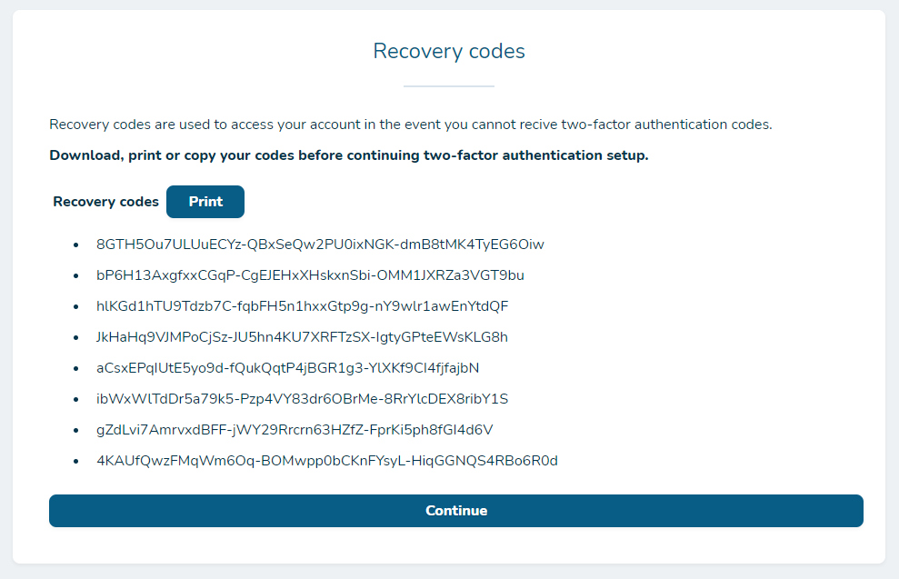
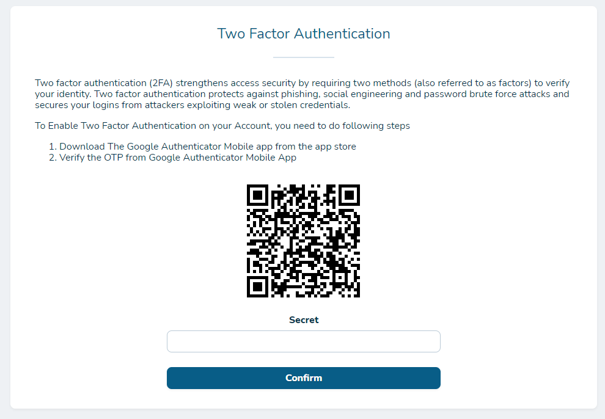
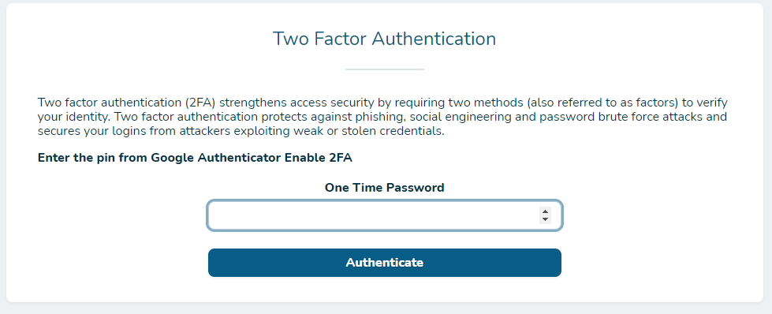
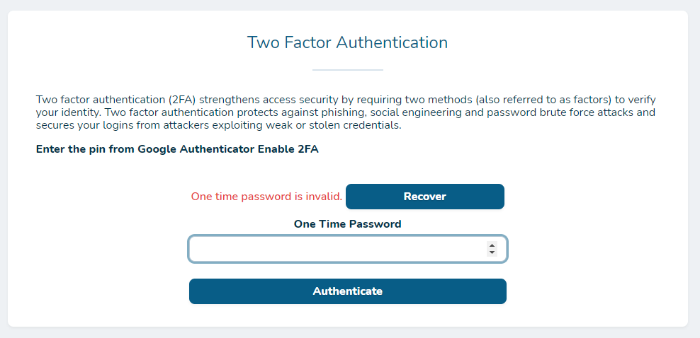
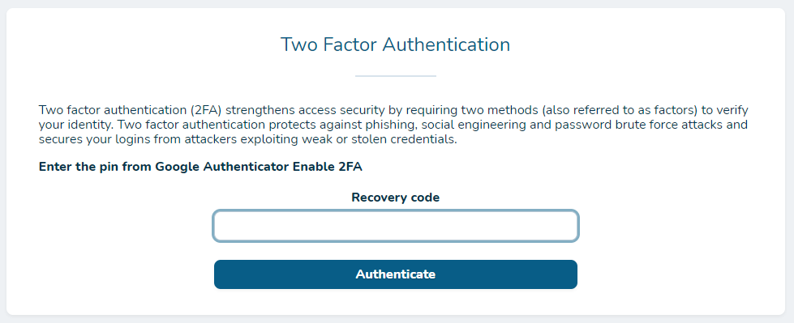

## netsells/nova-google2fa

This package enforces 2FA for Laravel Nova.

## Dependencies
* PHP 7.4 or higher
* Imagik

## Flow

### Activation

- User gets recovery codes.



- User activates 2FA on his device.



### Verification

- User verifies login with 2FA.



### Recovery

- If user enters invalid code, recovery button is shown.



- User enters recovery code.



- User is redirected to activation process.

## Installation

Install via composer

``` bash
$ composer require netsells/nova-google2fa
```

Publish config

``` bash
$ php artisan vendor:publish --provider="Lifeonscreen\Google2fa\ToolServiceProvider" --tag=lifeonscreen2fa.config
```

Publish migrations

``` bash
$ php artisan vendor:publish --provider="Lifeonscreen\Google2fa\ToolServiceProvider" --tag=migrations
```

Publish views (optional)

``` bash
$ php artisan vendor:publish --provider="Lifeonscreen\Google2fa\ToolServiceProvider" --tag=views
```

Or publish all in one go (optional)

``` bash
$ php artisan vendor:publish --provider="Lifeonscreen\Google2fa\ToolServiceProvider"
```

Run migrations

``` bash
$ php artisan migrate
```

Add relation to User model
```php
use Lifeonscreen\Google2fa\Models\User2fa;

...

/**
 * @return HasOne
 */
public function user2fa(): HasOne
{
    return $this->hasOne(User2fa::class);
}
```

Add middleware to `config/nova`.
```php
[
    ...
    'middleware' => [
        ...
        \Lifeonscreen\Google2fa\Http\Middleware\Google2fa::class,
        ...
    ],
]
```

## Config

```php
return [
    /**
     * Disable or enable middleware.
     */
    'enabled' => env('GOOGLE_2FA_ENABLED', true),

    'models' => [
        /**
         * Change this variable to path to user model.
         */
        'user' => 'App\User',
        
        /**
         * Change this if you need a custom connector
         */
        'user2fa' => User2fa::class,
    ],
    'tables' => [
        /**
         * Table in which users are stored.
         */
        'user' => 'users',
    ],

    'recovery_codes' => [
        /**
         * Number of recovery codes that will be generated.
         */
        'count'          => 8,

        /**
         * Number of blocks in each recovery code.
         */
        'blocks'         => 3,

        /**
         * Number of characters in each block in recovery code.
         */
        'chars_in_block' => 16,

        /**
         * The following algorithms are currently supported:
         *  - PASSWORD_DEFAULT
         *  - PASSWORD_BCRYPT
         *  - PASSWORD_ARGON2I // available from php 7.2
         */
        'hashing_algorithm' => PASSWORD_BCRYPT,
    ],
];
```

## Security

If you discover any security-related issues, please email the author instead of using the issue tracker.
## Credits 
- [Jani Cerar](https://github.com/janicerar)

## License

MIT license. Please see the [license file](docs/license.md) for more information.

[ico-version]: https://img.shields.io/packagist/v/lifeonscreen/nova-google2fa.svg?style=flat-square
[ico-downloads]: https://img.shields.io/packagist/dt/lifeonscreen/nova-google2fa.svg?style=flat-square

[link-packagist]: https://packagist.org/packages/lifeonscreen/nova-google2fa
[link-downloads]: https://packagist.org/packages/lifeonscreen/nova-google2fa
[link-author]: https://github.com/LifeOnScreen

Fork created and maintained by the [Netsells team](https://netsells.co.uk/)
